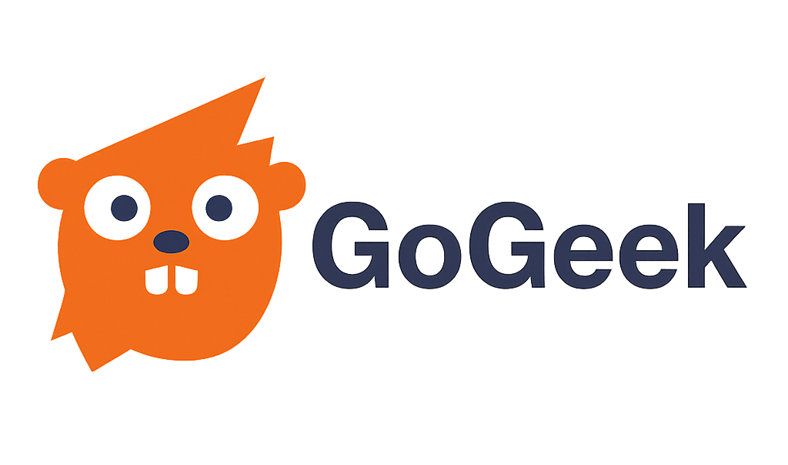

<p align="center">
  
</p>

# GoGeek: Go Module for the BoardGameGeek API

[](https://pkg.go.dev/github.com/kkjdaniel/gogeek)
[](https://goreportcard.com/report/github.com/kkjdaniel/gogeek)
[](https://codecov.io/gh/kkjdaniel/gogeek)

GoGeek is a lightweight, easy-to-use Go module designed to streamline interactions with the [BoardGameGeek API](https://boardgamegeek.com/wiki/page/BGG_XML_API2) (XML API2).

## Key Features

- **🔄 Simple Request Handling**: GoGeek abstracts the BGG API request process, allowing you to focus on utilising the data rather than managing HTTP requests.
- **🔐 Authentication Support**: Built-in support for API key and cookie-based authentication to access authenticated endpoints.
- **📄 Data Parsing**: Automatically converts and normalises XML responses from the BGG API into Go structs, so you can work with structured data effortlessly.
- **⚠️ Error Handling**: Robust error handling for common issues like network errors, rate limiting, queued requests and unexpected response formats.

## Setup

To setup GoGeek, use the following `go get` command:

```bash
go get github.com/kkjdaniel/gogeek/v2
```

## Usage

### Basic Usage

Getting started with GoGeek is easy. First, create a client, then use it to make API requests:

```go
package main

import (
	"fmt"
	"log"

	"github.com/kkjdaniel/gogeek/v2"
	"github.com/kkjdaniel/gogeek/v2/thing"
)

func main() {
	// Create a client
	client := gogeek.NewClient()

	// Query board games by BGG ID
	games, err := thing.Query(client, []int{13, 12, 3})
	if err != nil {
		log.Fatal(err)
	}

	for _, game := range games.Items {
		fmt.Printf("Name: %s\nYear Published: %d\n", game.Name[0].Value, game.YearPublished.Value)
	}
}
```

```
Name: CATAN
Year Published: 1995
Name: Ra
Year Published: 1999
Name: Samurai
Year Published: 1998
```

### Authentication

Most BGG endpoints now require authorisation. GoGeek supports multiple authentication methods.

**API Key Authentication** (recommended):

```go
client := gogeek.NewClient(gogeek.WithAPIKey("your-api-key"))
collection, err := collection.Query(client, "username")
```

Note: To get an API key you can request one via the [application form here.](https://boardgamegeek.com/applications)

**Cookie Authentication**:

```go
cookie := "bggusername=user; bggpassword=pass; SessionID=xyz"
client := gogeek.NewClient(gogeek.WithCookie(cookie))
user, err := user.Query(client, "username")
```

### Rate Limiting

All clients automatically enforce rate limiting of **2 requests per second** to comply with BoardGameGeek's API guidelines.

### Notes

- The `thing` query allows you to fetch details about specific board games by BGG ID
- There is a query limit of 20 IDs per query due to BGG API restrictions
- If you need to fetch multiple games, batch your requests accordingly

## Documentation

For the full documentation please see the [GoDoc here](https://pkg.go.dev/github.com/kkjdaniel/gogeek/v2). Details on how to use each query function as well as the interfaces for each of the APIs can be found within their respective packages.

## Contributing

Contributions are welcome! Please feel free to submit a pull request or open an issue on GitHub to help improve GoGeek.
