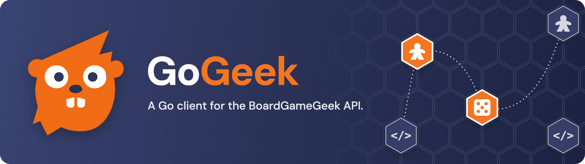

<a href="https://pkg.go.dev/github.com/kkjdaniel/gogeek/v3"></a>

GoGeek is a Go client for the [BoardGameGeek API](https://boardgamegeek.com/wiki/page/BGG_XML_API2) (XML API2). It handles the HTTP requests, authentication, rate limiting, and XML parsing so you can work with plain Go structs.

[](https://pkg.go.dev/github.com/kkjdaniel/gogeek/v3)
[](https://github.com/kkjdaniel/gogeek/actions/workflows/lint.yml)
[](https://codecov.io/gh/kkjdaniel/gogeek)
[](https://github.com/kkjdaniel/gogeek/actions/workflows/contract-tests.yml)

## Setup

Install with `go get`:

```bash
go get github.com/kkjdaniel/gogeek/v3
```

## Usage

### Basic usage

Create a client, then use it to make API requests:

```go
package main

import (
	"context"
	"fmt"
	"log"

	"github.com/kkjdaniel/gogeek/v3"
	"github.com/kkjdaniel/gogeek/v3/thing"
)

func main() {
	// Create a client (all BGG endpoints require authentication,
	// see the Authentication section below)
	client := gogeek.NewClient(gogeek.APIKey("your-api-key"))

	// Query board games by BGG ID
	games, err := thing.Query(context.Background(), client, []int{13, 12, 3})
	if err != nil {
		log.Fatal(err)
	}

	for _, game := range games.Items {
		fmt.Printf("Name: %s\nYear Published: %d\n", game.Name[0].Value, game.YearPublished.Value)
	}
}
```

```
Name: CATAN
Year Published: 1995
Name: Ra
Year Published: 1999
Name: Samurai
Year Published: 1998
```

### Authentication

All BGG endpoints require authorisation. Anonymous access is no longer supported by the API, so every client is constructed with credentials.

**API key** (recommended):

```go
client := gogeek.NewClient(gogeek.APIKey("your-api-key"))
collection, err := collection.Query(ctx, client, "username")
```

You can request an API key via BGG's [application form](https://boardgamegeek.com/applications).

**Cookie**:

```go
cookie := "bggusername=user; bggpassword=pass; SessionID=xyz"
client := gogeek.NewClient(gogeek.Cookie(cookie))
user, err := user.Query(ctx, client, "username")
```

### Rate limiting and retries

By default, every client:

- Limits requests to **2 per second**, in line with BoardGameGeek's API guidelines
- Times out requests after 30 seconds
- Retries queued (202) and throttled (429/503) responses with exponential backoff

Each of these can be changed with client options:

```go
client := gogeek.NewClient(
	gogeek.APIKey("your-api-key"),
	gogeek.WithRateLimit(1),
	gogeek.WithRetry(3, time.Second),
	gogeek.WithHTTPClient(custom),
)
```

### Notes

- Every query takes a `context.Context`, so requests can be cancelled or given deadlines
- The `thing` query accepts any number of IDs; batches of more than 20 are split into multiple rate-limited requests automatically
- Query filters use per-package options (e.g. `plays.WithPage(2)`, `collection.WithOwned(true)`); invalid option values return an error wrapping `gogeek.ErrInvalidOption` before any request is made
- Some options request extra data, such as `thing.WithVideos()`, which populates each item's `Videos` field with its community-submitted videos

## API support

Every endpoint in the [BGG XML API2](https://boardgamegeek.com/wiki/page/BGG_XML_API2) is supported, along with all of its working parameters.

| API endpoint | Package | Supported |
|---|---|:---:|
| [`/thing`](https://boardgamegeek.com/wiki/page/BGG_XML_API2#toc3) | [`thing`](https://pkg.go.dev/github.com/kkjdaniel/gogeek/v3/thing) | ✅ |
| [`/family`](https://boardgamegeek.com/wiki/page/BGG_XML_API2#toc4) | [`family`](https://pkg.go.dev/github.com/kkjdaniel/gogeek/v3/family) | ✅ |
| [`/forumlist`](https://boardgamegeek.com/wiki/page/BGG_XML_API2#toc5) | [`forumlist`](https://pkg.go.dev/github.com/kkjdaniel/gogeek/v3/forumlist) | ✅ |
| [`/forum`](https://boardgamegeek.com/wiki/page/BGG_XML_API2#toc6) | [`forum`](https://pkg.go.dev/github.com/kkjdaniel/gogeek/v3/forum) | ✅ |
| [`/thread`](https://boardgamegeek.com/wiki/page/BGG_XML_API2#toc7) | [`thread`](https://pkg.go.dev/github.com/kkjdaniel/gogeek/v3/thread) | ✅ |
| [`/user`](https://boardgamegeek.com/wiki/page/BGG_XML_API2#toc8) | [`user`](https://pkg.go.dev/github.com/kkjdaniel/gogeek/v3/user) | ✅ |
| [`/guild`](https://boardgamegeek.com/wiki/page/BGG_XML_API2#toc9) | [`guild`](https://pkg.go.dev/github.com/kkjdaniel/gogeek/v3/guild) | ✅ |
| [`/plays`](https://boardgamegeek.com/wiki/page/BGG_XML_API2#toc10) | [`plays`](https://pkg.go.dev/github.com/kkjdaniel/gogeek/v3/plays) | ✅ |
| [`/collection`](https://boardgamegeek.com/wiki/page/BGG_XML_API2#toc11) | [`collection`](https://pkg.go.dev/github.com/kkjdaniel/gogeek/v3/collection) | ✅ |
| [`/hot`](https://boardgamegeek.com/wiki/page/BGG_XML_API2#toc12) | [`hot`](https://pkg.go.dev/github.com/kkjdaniel/gogeek/v3/hot) | ✅ |
| [`/search`](https://boardgamegeek.com/wiki/page/BGG_XML_API2#toc14) | [`search`](https://pkg.go.dev/github.com/kkjdaniel/gogeek/v3/search) | ✅ |

Parameters the API itself no longer supports (`historical`, `from`, and `to` on `/thing`; `username` on `/thread`) are omitted, and geeklists are excluded because they were never added to XML API2.

## Documentation

Full documentation is on [pkg.go.dev](https://pkg.go.dev/github.com/kkjdaniel/gogeek/v3). Each package documents its query function and the structs it returns.

## Contributing

Contributions are welcome. Open an issue or submit a pull request on GitHub to help improve GoGeek.
